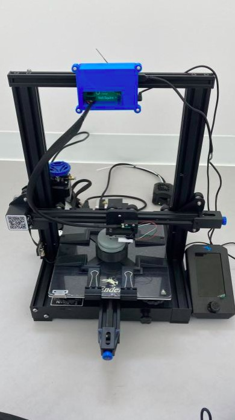

 <!--- 
TITLE
Should match the name of the GitHub repository. Choose something descriptive rather than whimsical. 
 --->
 # Assistive Switch Testing System - CG65

<!--- 
SUMMARY
A brief summary of the project. What it does, who it is for, how much it costs.
 --->
We are from UBC ECE Capstone Group CG65 and our project is to build a cost-effective test system for engineers to test the assistive switch for Neil Squire's Program Makers Making Change. The testing system is made from modifying a commercially available 3D printer, low cost electrical components, 3D printed parts and specially designed user interface.

<!--- 
PHOTO

 --->

<!--- 
## More info at
 - [Makers Making Change Forum Thread](TBD) 
 - [Makers Making Change Project Page](TBD)
 --->

## Getting Started
<!--- 
Include an overall idea of what major steps are required to build the device.
 --->

### 1. Order the 3D printer
Our testing system will be assembled on a 3D printer. For our project, we've chosen the Ender 3 V2 from [3D Printing Canada](https://3dprintingcanada.com/products/creality-ender-3-v2) since it is CSA and ETL safety certified. So far, this testing system has been implemented on an Ender 3 V2 and you can acquire the same model from any available store.

### 2. Order and assemble the activation circuit
The activation circuit will be used to receive and send signals from the load cell and switch to a computer.

All of the files and documentation can be found in the [/Electronics/Activation_Circuit/PCB_Assembly_Guide.pdf](https://github.com/Goshe00/Assistive-Switch-Testing-System---CG65/tree/main/Electronics/Activation%20Circuit) folder.

### 3. Order and assemble the force sensor

The force sensor includes the load cell and its adapter. It will be used to send signals to the PCB during a testing routine.

All of the documentation can be found in the [/Electronics/Force Sensor](https://github.com/Goshe00/Assistive-Switch-Testing-System---CG65/tree/main/Electronics/Force%20Sensor) folder. Individual print files of the adapter can be found in [/3D_Printing_Files/Load_Cell_Adapter](https://github.com/Goshe00/Assistive-Switch-Testing-System---CG65/tree/main/3D%20Printing%20Files/Load%20Cell%20Adapter) folder. The code to configure the microcontroller can be found in [/Software/ESP](https://github.com/Goshe00/Assistive-Switch-Testing-System---CG65/tree/main/Software/ESP32)

### 4. Install and setup Neoprint, our testing system's user interface

Neoprint is a Python program specifically for this testing system that enables the user to set up, run test routines and generate data. 

All of the build documentation and files can be found in the [/Software/Neoprint](/Software/Neoprint) folder. 

### 5. Assemble the force sensor, activation circuit and Neoprint

After assembling and setting up each of the subcomponents, they can be assembled together to build the testing system.

User guides of each subcomponents can be found in their respective folders. 

### 6. Assemble the switch 

The testing procedure starts by deciding which switch is needed to be tested. For this project, we have implemented a testing procedure for the MMC60 switch. 

### 7. Print and assemble the switch adapter

In order for the switch to be fixed on the printbed, an adapter is needed to hold the switch so that it does not move or rotate during testing.

All individual print files and documentation of MMC60 switch and Interact switch can be found in [/3D_Printing_Files/MMC60_Jig](https://github.com/Goshe00/Assistive-Switch-Testing-System---CG65/tree/main/3D%20Printing%20Files/MMC60%20Jig) folder and [/3D_Printing_Files/Interact_Switch_Jig](https://github.com/Goshe00/Assistive-Switch-Testing-System---CG65/tree/main/3D%20Printing%20Files/Interact%20Switch%20Jig) folder.

### 8. Run testing routine

Now that the testing system is assembled and a switch to test has been chosen, you are ready to run a test!

The detailed testing routine instructions can be found at [/Software/Neoprint](/Software/Neoprint).

## Future Works

### 1. Locking jigs for other types of assistive switches

For this project, we only focused on building and testing the MMC60 Switch and Interact Switch. The testing routine requires a specific locking jig design for different types of switches. We have developed a Locking Jig Design Guide in [/3D Printing Files](https://github.com/Goshe00/Assistive-Switch-Testing-System---CG65/blob/main/3D%20Printing%20Files/Locking%20Jig%20Design%20Guide.pdf) for future developments of other types of locking jig designs. 

### 2. Button profiles for other types of assistive switches

The software requires the dimensions of the button to automatically generate testpoint locations. The current code uses the dimension of the MMC60 button (60mm diameter). To test other cylindrical buttons, the variables "BUTTON_MAX_COORD" and "self.window_size" in mode_window_layout.py would need to be changed to the diameter (in mm) of the button. Adding button profiles would make it easier to test different buttons   

## License
<!---
LICENSE
Choose an appropriate license. We recommend an open-source hardware compatible license.
--->
Everything (excluding Ender 3 V2) needed or used to design, make, test, or prepare the Assistive Switch Testing System is licensed under the CERN 2.0 Weakly Reciprocal license <https://ohwr.org/project/cernohl/wikis/Documents/CERN-OHL-version-2> (CERN-OHL-W).

Accompanying material such as instruction manuals, videos, and other copyrightable works that are useful but not necessary to design, make, test, or prepare the Assistive Switch Testing System are published under a Creative Commons Attribution-ShareAlike 4.0 license <https://creativecommons.org/licenses/by-sa/4.0/> (CC BY-SA 4.0).

## Attribution
<!---
ATTRIBUTION
Include any information related to the development of the design. This may include who identified the initial challenge, who contributed to the design
--->

The documentation template was created by Makers Making Change and is used under a CC BY-SA 4.0 license. It is available at the following link: https://github.com/makersmakingchange/OpenAT-Template

## About Makers Making Change

Makers Making Change is an initiative of [Neil Squire](https://www.neilsquire.ca/), a Canadian non-profit that uses technology, knowledge, and passion to empower people with disabilities.

We are committed to cultivating a network of volunteer makers who support people with disabilities in their communities through cost effective assistive technology. Check out our library of free, open-source assistive technologies.

 - Website: [www.MakersMakingChange.com](https://www.makersmakingchange.com/)
 - [GitHub](https://github.com/makersmakingchange)
 - [Thingiverse](https://www.thingiverse.com/makersmakingchange/about)
 - Twitter: [@makermakechange](https://twitter.com/makermakechange)
 - Instagram: [@makersmakingchange](https://www.instagram.com/makersmakingchange)

### Contacts
For technical questions, to get involved, or to share your experience we encourage you to visit [MMC Forum](https://forum.makersmakingchange.com) or contact info@makersmakingchange.com

## About UBC ECE Capstone CG65

We are a group of five Electrical Engineering students that are enrolled in the UBC ECE Capstone program. Our capstone group includes:

1. Daniel Wu, developer of NeoPrint and testing routine
2. Karat Wannissorn, assisted in documenting and developing NeoPrint
3. Henry Bryant, designed button activation circuit and force sensor
4. Sean Fu, assisted in researching force sensor alternatives
5. Shadeed Lagani, designed 3D models and researched locking jigs 

### Contacts
For technical questions, contact ubcece65neilsquire@gmail.com

